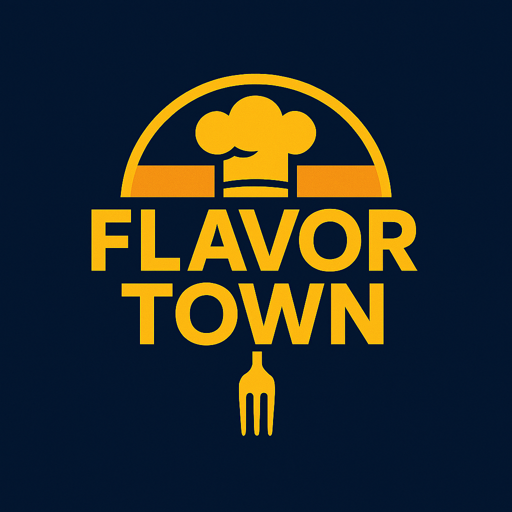

# 🍔 Flavortown – Online-Bestell-App / Online Ordering App 🍕  

  

## 📖 Projektbeschreibung / Project Description
Flavortown ist eine **interaktive Online-Bestell-App** für Burger & Pizza.  
Benutzer*innen können Gerichte auswählen, den Warenkorb verwalten und Bestellungen simuliert abschicken.  

Flavortown is an **interactive online ordering app** for burgers & pizza.  
Users can select dishes, manage their cart, and simulate orders.  

💡 Dieses Projekt wurde im Rahmen der **Weiterbildung bei der Developer Akademie** erstellt.  
💡 This project was created as part of the **Developer Akademie training program**.

---

## 🚀 Features
- 🍔 Dynamische Anzeige der Gerichte / Dynamic dish display  
- 🛒 Warenkorb mit Menge ändern, entfernen & Gesamtsumme / Cart with quantity adjust, remove & total  
- 📱 Mobiler Overlay-Warenkorb / Mobile overlay cart  
- ✅ Checkout / Simulated checkout  
- 🌐 Responsives Layout / Responsive layout  
- 🎨 Hero-Bereich & Call-to-Action / Hero section & call-to-action  
- 📞 Footer mit Kontakt & Social Media / Footer with contact & social media  

---

## 🛠️ Tech-Stack
- HTML5, CSS3 (Flexbox & Grid), JavaScript (ES6)  
- Lizenzfreie Bilder von [Pixabay](https://pixabay.com/)  
- Overlay-Bild generiert mit GitHub Copilot  

---

## ⚡ Installation
1. Repository klonen / Clone repository:  
```bash
git clone https://github.com/username/flavortown.git

cd flavortown
open index.html

🎯 Nutzung / Usage

Gericht auswählen / Select a dish
„Hinzufügen“ klicken / Click “Add”
Menge anpassen oder entfernen / Adjust quantity or remove
„Bestellen“ klicken / Click “Checkout”

📜 Lizenz & Hinweise / License & Notes

Alle Bilder sind lizenzfrei oder vom Entwickler erstellt / All images are royalty-free or developer-generated
Externe Links öffnen in neuem Tab / External links open in new tab
Projekt dient nur zu Übungszwecken / Project is for practice and demonstration only

👤 Autor / Author

Jermaine Jérôme
Email: jay.jero1901@gmail.com